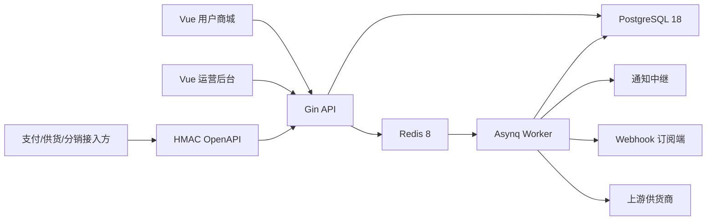

# 架构说明

## 一致性边界

创建订单时，订单、订单项、卡密锁定和订单事件在一个 PostgreSQL 事务中提交。支付回调对支付意图加行锁，检查事件唯一性、渠道、状态和金额，再在同一事务中把预占卡密改为已售并将订单改为已交付。失败会整体回滚。

未支付卡密只以 AES-GCM 密文出现在订单项中，查询接口只在订单状态为 `delivered` 时解密。超时或管理员取消会释放卡密，并清除未支付订单项中的密文副本。

## 进程

- `linlinqi api`：HTTP API、健康检查和指标。
- `linlinqi worker`：队列消费者与内置定时调度。
- `linlinqi migrate`：只执行迁移后退出。
- `linlinqi all`：本地开发同时运行 API 与 Worker。

## 领域边界

- Identity：用户、管理员、会话、角色、权限、TOTP、登录事件。
- Catalog：分类、商品、规格、价格、库存、购物车与映射。
- Commerce：订单、支付、退款、交付、工单、风控与对账。
- Supply：供货商、连接、采购与回调。
- Finance：钱包、礼品卡、推广、分销与提现。
- Content/Operations：文章、媒体、通知、Webhook、任务和安全事件。

## 扩展协议

支付和供货均使用 LinLinQi 自有的 provider-neutral HMAC 协议，避免核心交易依赖某个聚合平台。新增适配器应实现现有 `payment.Driver` 或 `supply.Client` 边界，不得在订单服务内写第三方特例。
